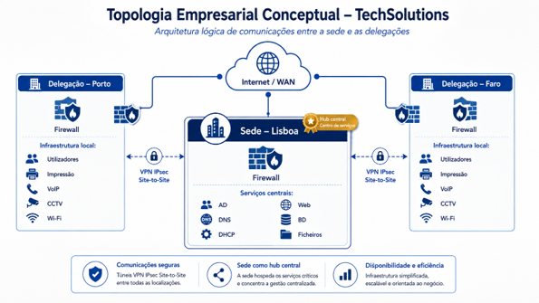
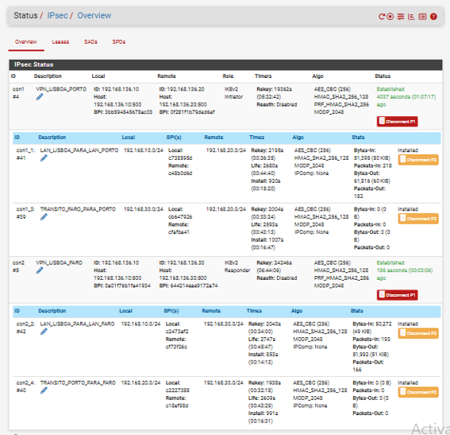
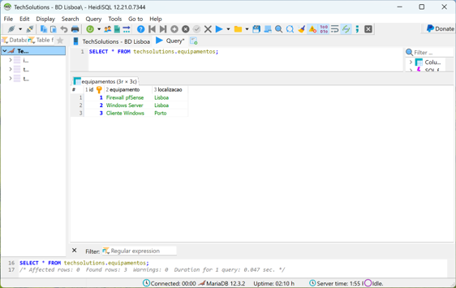
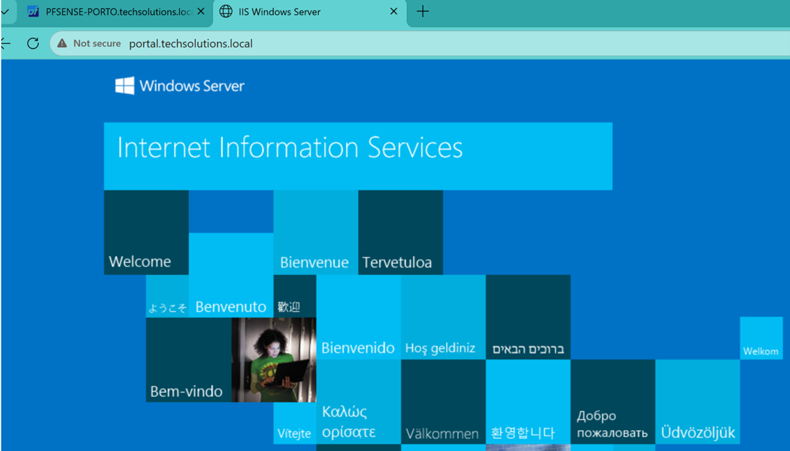
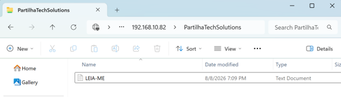
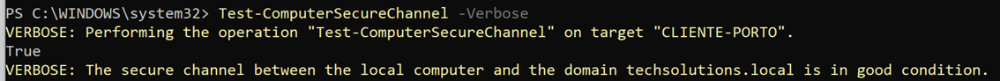

# Secure Multi-Site Enterprise VPN

**Enterprise network infrastructure lab integrating pfSense IPsec, Windows Server, Active Directory and centralized services across three geographically separated sites.**

  

## Overview

This project designs and validates a secure multi-site infrastructure for a fictional 41-user organization distributed across Lisbon, Porto and Faro.

Lisbon operates as the central site and IPsec hub, hosting the shared infrastructure services used by the remote branches. Porto and Faro connect securely to Lisbon through site-to-site IPsec tunnels, with controlled inter-site transit through the central firewall.

The project combines two complementary perspectives:

- an **enterprise infrastructure design**, covering topology, addressing, security policy and service architecture;
- a **functional VMware laboratory**, used to implement, test, troubleshoot and validate the proposed solution.

The laboratory integrates pfSense firewalls, Windows Server, Active Directory Domain Services, DNS, DHCP, IIS, MariaDB and SMB services.

Validation was performed progressively from network connectivity to application-layer functionality. Controlled faults were then introduced to test an evidence-driven troubleshooting methodology, followed by an additional real Active Directory secure channel incident discovered during final validation.

## Project Scope

The project covers the design, implementation and validation of a three-site enterprise infrastructure with centralized services and secure inter-site connectivity.

Core components include:

- pfSense firewalls at Lisbon, Porto and Faro;
- IKEv2 site-to-site IPsec;
- hub-and-spoke topology with Lisbon as the central hub;
- Porto-Faro transit through Lisbon;
- Windows Server infrastructure;
- Active Directory Domain Services;
- internal DNS and DHCP;
- IIS internal web service;
- MariaDB database service;
- SMB file sharing;
- Windows domain clients;
- service-specific firewall policies;
- controlled troubleshooting and root-cause validation;
- rollback and change-management planning;
- technical cost estimation.

## Architecture

### Site Roles

| Location | Role | Users |
|---|---|---:|
| Lisbon | Headquarters, VPN hub and centralized services | 25 |
| Porto | Remote branch using centralized Lisbon services | 10 |
| Faro | Remote branch with inter-site communication through Lisbon | 6 |
| **Total** |  | **41** |

Lisbon acts as the infrastructure core. Active Directory, DNS, DHCP, IIS, MariaDB and SMB are centralized on `SRV-LISBOA`, while Porto and Faro consume those services through the IPsec infrastructure.

The enterprise design and the laboratory implementation are deliberately separated: the enterprise layer represents the proposed business architecture, while the VMware environment reproduces the network and service dependencies required to validate the design.

### Laboratory Networks

| Site / Function | Network | Gateway |
|---|---|---|
| Lisbon LAN | `192.168.10.0/24` | `192.168.10.1` |
| Porto LAN | `192.168.20.0/24` | `192.168.20.1` |
| Faro LAN | `192.168.30.0/24` | `192.168.30.1` |
| VMware WAN transport | `192.168.136.0/24` | Simulated transport network |

The pfSense WAN interfaces use stable laboratory addresses:

- Lisbon: `192.168.136.10`
- Porto: `192.168.136.20`
- Faro: `192.168.136.30`

The `192.168.136.0/24` network is not an internal TechSolutions LAN. It represents the simulated WAN transport used between the VPN peers.

### Centralized Services

| Service | Laboratory Implementation |
|---|---|
| Active Directory | `techsolutions.local` on `SRV-LISBOA` |
| DNS | Internal DNS on `192.168.10.82` |
| DHCP | Centralized Windows DHCP service |
| IIS | `http://portal.techsolutions.local` |
| MariaDB | Database service on TCP `3306` |
| SMB | `\\192.168.10.82\PartilhaTechSolutions` |

The laboratory was designed to validate dependencies and service behavior rather than reproduce every physical device from the enterprise reference architecture.

## IPsec Design & Final State

Lisbon operates as the IPsec hub, with independent site-to-site tunnels to Porto and Faro.

### Phase 1

Both tunnels use the same IKE security profile:

| Parameter | Configuration |
|---|---|
| IKE version | IKEv2 |
| Authentication | Pre-Shared Key |
| Encryption | AES-CBC 256-bit |
| Integrity | HMAC-SHA2-256 |
| PRF | HMAC-SHA2-256 |
| Diffie-Hellman group | MODP 2048 / Group 14 |

The pre-shared keys are intentionally excluded from the repository.

VPN peers:

- Lisbon ↔ Porto: `192.168.136.10` ↔ `192.168.136.20`
- Lisbon ↔ Faro: `192.168.136.10` ↔ `192.168.136.30`

### Phase 2 Traffic Selectors

Four Phase 2 associations were implemented to support both direct site-to-hub communication and Porto-Faro transit through Lisbon.

| Phase 2 | Local Network | Remote Network | Purpose |
|---|---|---|---|
| `LAN_LISBOA_PARA_LAN_PORTO` | `192.168.10.0/24` | `192.168.20.0/24` | Lisbon-Porto traffic |
| `TRANSITO_FARO_PARA_PORTO` | `192.168.30.0/24` | `192.168.20.0/24` | Faro-Porto transit |
| `LAN_LISBOA_PARA_LAN_FARO` | `192.168.10.0/24` | `192.168.30.0/24` | Lisbon-Faro traffic |
| `TRANSITO_PORTO_PARA_FARO` | `192.168.20.0/24` | `192.168.30.0/24` | Porto-Faro transit |

This preserves the hub-and-spoke architecture while allowing the two branches to communicate through Lisbon without requiring a direct Porto-Faro IPsec tunnel.

### Final VPN State

  

At final validation:

- Lisbon-Porto Phase 1 was **Established**;
- Lisbon-Faro Phase 1 was **Established**;
- all four required Phase 2 associations were **Installed**;
- traffic counters showed packet and byte activity across the tunnels.

`Established` confirms successful IKE negotiation between the VPN peers.

`Installed` confirms that the corresponding IPsec traffic Security Associations are available for the configured protected networks.

Traffic counters provide additional evidence that the tunnels were not merely configured but were actively carrying traffic.

### Evidence Boundary

The IPsec status proves tunnel negotiation and Security Association state.

It does **not**, by itself, prove that DNS, web, database, file-sharing or Active Directory services are functional across the VPN.

Those services were validated independently at the application layer.

## Application-Layer Validation

VPN status alone was not treated as proof of service availability.

After validating the IPsec layer, the centralized services hosted in Lisbon were tested independently from remote clients. Selected evidence from `CLIENTE-PORTO` is shown below; final validation also confirmed service access from `CLIENTE-FARO`.

| Service | Validation Method | Result |
|---|---|---|
| DNS | Resolve `portal.techsolutions.local` using internal DNS | Passed |
| IIS | Open internal portal by DNS name | Passed |
| MariaDB | TCP `3306` + real SQL query | Passed |
| SMB | TCP `445` + access shared folder | Passed |
| Active Directory | `Test-ComputerSecureChannel` | `True` |

### MariaDB — Remote SQL Query

A real database query was executed remotely against the MariaDB service on `SRV-LISBOA`.

  

This validates more than TCP `3306` reachability: the client established an application session and successfully retrieved data from the database.

### IIS and Internal DNS

The internal IIS portal was accessed using:

`http://portal.techsolutions.local`

  

Successful page loading by hostname jointly validates internal DNS resolution, VPN transport, firewall authorization and HTTP service availability.

The browser's **Not secure** indication is expected because this proof of concept uses HTTP rather than HTTPS.

### SMB File Sharing

The centralized share was accessed from the remote client at:

`\\192.168.10.82\PartilhaTechSolutions`

  

This confirms functional SMB access to the centralized file service rather than port reachability alone.

### Active Directory Secure Channel

The machine-domain relationship was validated with:

`Test-ComputerSecureChannel -Verbose`

  

The final result returned:

`True`

confirming a healthy secure channel between the remote domain client and `techsolutions.local`.

### Validation Principle

Each layer was validated with the strongest practical test available:

**Network reachability → Port availability → Name resolution → Application access → Domain trust**

This avoided treating a successful ping or an established VPN tunnel as sufficient evidence that business services were operational.

## Key Outcomes

The final laboratory demonstrated the complete multi-site service path rather than VPN connectivity alone.

| Area | Final Result |
|---|---|
| Multi-site topology | Lisbon, Porto and Faro implemented |
| Virtual laboratory | Six primary VMware virtual machines |
| Lisbon-Porto VPN | Operational |
| Lisbon-Faro VPN | Operational |
| Porto-Faro communication | Validated through Lisbon |
| IPsec Phase 2 | Four required associations installed |
| Active Directory | Centralized and operational |
| DNS / DHCP | Implemented on `SRV-LISBOA` |
| IIS / MariaDB / SMB | Remotely validated |
| Controlled incidents | Five diagnosed, corrected and retested |
| Additional AD incident | Root cause identified and secure channel restored |
| Firewall policy | Refined toward service-specific least privilege |
| Recovery planning | VMware rollback snapshots maintained |

### Engineering Approach

The project was structured around several operational principles:

- distinguish the **proposed enterprise architecture** from what was physically reproduced in the laboratory;
- validate services at the highest practical layer instead of relying only on ping or open ports;
- change one fault condition at a time during troubleshooting;
- preserve a known-good baseline before introducing failures;
- use observed evidence to isolate the failing layer before applying corrections;
- retest the original symptom after every correction;
- replace temporary diagnostic permissions with permanent least-privilege rules;
- maintain rollback capability before high-impact configuration changes.

This approach makes the laboratory useful not only as an implementation exercise, but also as a documented troubleshooting and change-management case study.

## Troubleshooting

Troubleshooting was performed using a controlled, evidence-driven methodology:

**Known-good baseline → Symptom → Evidence → Hypothesis → Root cause → Correction → Retest**

Five failures were deliberately introduced to validate the diagnostic process. An additional Active Directory secure channel failure was discovered naturally during final validation and investigated as a real incident.

| Incident | Primary Symptom | Root Cause | Final Validation |
|---|---|---|---|
| [01 — IPsec PSK Authentication Failure](incidents/01-ipsec-psk-authentication-failure.md) | Phase 1 authentication failed | Mismatched pre-shared key | Phase 1 `Established`, Phase 2 `Installed`, 0% packet loss |
| [02 — Phase 2 Selector Mismatch](incidents/02-phase2-selector-mismatch.md) | Phase 1 remained established but protected traffic failed | Incorrect remote network selector | Phase 2 `Installed`, 0% packet loss |
| [03 — Incomplete Firewall Policy](incidents/03-firewall-policy.md) | ICMP, DNS and SMB unavailable through an active VPN | Insufficient service-specific firewall permissions | ICMP, DNS and SMB independently restored |
| [04 — Incorrect DNS Configuration](incidents/04-dns-misconfiguration.md) | Internal hostname returned NXDOMAIN | Client using public DNS `8.8.8.8` instead of corporate DNS | `portal.techsolutions.local` resolved to `192.168.10.82` |
| [05 — Incorrect Default Gateway](incidents/05-default-gateway.md) | Remote network unreachable from `CLIENTE-PORTO` | Default gateway changed to `192.168.20.254` | Gateway restored to `192.168.20.1`, 0% packet loss |
| [06 — Active Directory Secure Channel Failure](incidents/06-ad-secure-channel.md) | `Test-ComputerSecureChannel` returned `False` | Required AD flows blocked by firewall policy | Dedicated least-privilege AD rules, repair successful, secure channel remained `True` |

### Diagnostic Principles

The incidents were used to separate failures across different layers rather than treating every connectivity problem as a VPN fault.

Key distinctions included:

- peer reachability vs. IKE authentication;
- Phase 1 state vs. Phase 2 traffic selectors;
- tunnel establishment vs. firewall authorization;
- IP connectivity vs. DNS resolution;
- infrastructure state vs. endpoint routing;
- ICMP reachability vs. Active Directory service dependencies.

Each incident document includes the observed symptom, evidence, diagnostic reasoning, root cause, correction and independent validation.

### Real Troubleshooting Case

The Active Directory secure channel failure was not deliberately introduced.

During final validation, `CLIENTE-PORTO` still showed domain membership but `Test-ComputerSecureChannel` returned `False`. ICMP connectivity to `SRV-LISBOA` remained operational while LDAP, Kerberos and RPC traffic was blocked.

A temporary diagnostic firewall permission confirmed the firewall as the failure point. It was then replaced with dedicated Active Directory TCP/UDP rules and aliases, the secure channel was repaired, the temporary permission was removed, and the final validation remained successful.

[Read the complete Active Directory incident →](incidents/06-ad-secure-channel.md)

## Project Status

**Completed laboratory implementation and validation.**

The final environment successfully demonstrated multi-site connectivity and remote access to centralized **Active Directory, DNS, IIS, MariaDB and SMB services**.

---

**Note:** This project was developed in an authorized laboratory environment for training and portfolio purposes. Credentials and other sensitive configuration values are intentionally excluded from the public documentation.
