# Secure Multi-Site Enterprise VPN

> Multi-site enterprise infrastructure lab integrating pfSense IPsec, Windows Server, Active Directory and centralized business services across three locations.

<p align="center">
  
</p>

## Overview

This project designs, implements and validates a secure multi-site network for a fictional organization with a headquarters in Lisbon and branch offices in Porto and Faro.

The solution was developed in two complementary layers:

- an **enterprise reference architecture**, covering segmentation, addressing, access policies, services and infrastructure requirements;
- a **functional VMware laboratory**, used to implement and validate the critical network and service dependencies of the proposed design.

Lisbon operates as the central hub and hosts the corporate services. Porto and Faro connect to headquarters through **pfSense IPsec Site-to-Site VPNs**, with inter-branch communication routed through Lisbon using a hub-and-spoke topology.

## Project Scope

The laboratory integrates:

- pfSense firewalls and gateways
- IKEv2 / IPsec Site-to-Site VPN
- Hub-and-spoke multi-site connectivity
- Windows Server
- Active Directory Domain Services
- DNS
- DHCP
- IIS
- MariaDB
- SMB file sharing
- Windows client endpoints
- Firewall policy and least-privilege access
- Structured troubleshooting
- Backup and rollback planning
- Technical intervention cost estimation

## Architecture

The enterprise scenario represents **41 users across three locations**:

| Location | Role | Users |
|---|---|---:|
| Lisbon | Headquarters and central services hub | 25 |
| Porto | Remote branch | 10 |
| Faro | Remote multifunction branch | 6 |

### Laboratory Networks

| Site | LAN | Gateway |
|---|---|---|
| Lisbon | `192.168.10.0/24` | `192.168.10.1` |
| Porto | `192.168.20.0/24` | `192.168.20.1` |
| Faro | `192.168.30.0/24` | `192.168.30.1` |

A dedicated VMware network was used as the simulated WAN transport between the three pfSense firewalls.

## IPsec Design & Final State

The VPN architecture uses **Lisbon as the central hub**, with Site-to-Site IPsec tunnels connecting the Porto and Faro branches to headquarters.

The implementation uses:

- **IKEv2** for Phase 1 negotiation
- Pre-shared key authentication
- AES-256 encryption
- SHA-256 integrity
- Dedicated Phase 2 selectors for each protected LAN
- Additional Phase 2 selectors for **Porto ↔ Faro inter-branch transit through Lisbon**

<p align="center">
  
</p>

The final pfSense status shows both Phase 1 connections in **Established** state and the required Phase 2 Security Associations in **Installed** state.

Traffic counters provide additional evidence that the tunnels were actively transporting traffic during validation.

> **What this proves:** IPsec negotiation succeeded and the required Security Associations were installed for the three-site topology.
>
> **What this does not prove by itself:** that DNS, HTTP, SMB, MariaDB or Active Directory are operational across the VPN. Those services were validated separately at the application layer.
>
> ## Application-Layer Validation

Establishing an IPsec tunnel was not considered sufficient proof that the environment was operational. Business services were validated separately from the remote branches.

### MariaDB

From the Porto client, connectivity to the centralized MariaDB service in Lisbon was validated at the application layer by executing a real SQL query:

```sql
SELECT * FROM techsolutions.equipamentos;
```

<p align="center">
  
</p>

The query successfully returned records from the database hosted in Lisbon.

> **What this proves:** the remote client could establish a functional MariaDB session through the VPN and execute SQL against the centralized database.
>
> **What this does not prove by itself:** the availability of the other centralized services or the overall health of the VPN. DNS, IIS, SMB and Active Directory were validated independently.

### IIS via Internal DNS

The internal web service hosted in Lisbon was validated from the Porto branch using the corporate DNS name:

`http://portal.techsolutions.local`

<p align="center">
  
</p>

Loading the IIS page by hostname validates more than basic HTTP connectivity: the remote client must first resolve the internal DNS name and then successfully reach the web service through the VPN and firewall policy.

> **What this proves:** internal DNS resolution, VPN routing, firewall access and IIS availability were functional for this request.
>
> **What this does not prove by itself:** HTTPS security or certificate validation. This laboratory test intentionally used HTTP.
>
> ### SMB File Service

The centralized SMB file service hosted in Lisbon was validated from the Porto branch by accessing the corporate share directly:

`\\192.168.10.82\PartilhaTechSolutions`

<p align="center">
  
</p>

The remote client successfully opened the share and accessed the `LEIA-ME` file.

> **What this proves:** SMB was usable at the application level across the VPN, not merely reachable on TCP port 445.
>
> **What this does not prove by itself:** that domain authentication and the computer trust relationship were healthy. Active Directory was validated separately.

### Active Directory Secure Channel

The Porto client was also validated as an active member of the centralized Active Directory domain.

```powershell
Test-ComputerSecureChannel -Verbose
```

<p align="center">
  
</p>

The command returned `True`, confirming that the secure channel between `CLIENTE-PORTO` and `techsolutions.local` was in good condition.

> **What this proves:** the remote Windows client maintained a functional trust relationship with the Active Directory domain across the multi-site infrastructure.
>
> **What this does not prove by itself:** that every Active Directory-dependent protocol or service is available under every firewall condition. The firewall dependencies were investigated separately during troubleshooting.

## Key Outcomes

- Established IPsec connectivity between **Lisbon ↔ Porto**
- Established IPsec connectivity between **Lisbon ↔ Faro**
- Implemented **Porto ↔ Faro transit through Lisbon**
- Centralized identity and network services in Lisbon
- Joined remote Windows clients to the corporate Active Directory domain
- Validated internal DNS resolution across the VPN
- Validated IIS access using an internal DNS name
- Executed real MariaDB queries from a remote branch
- Accessed SMB resources across the VPN
- Applied service-specific firewall rules instead of unrestricted access
- Diagnosed and corrected multiple controlled network failures
- Repaired an additional Active Directory secure-channel failure
- Defined rollback and change-management procedures
- Produced a technical cost estimate for the intervention

## Validation Approach

Validation was performed progressively by layer:

**Endpoint configuration → Local gateway → IP connectivity → Routing → VPN → Firewall → DNS → Application service**

This approach makes it possible to distinguish between a local endpoint problem, an IPsec failure, a firewall policy issue and an application-layer failure.

## Troubleshooting Scenarios

Six diagnostic scenarios were documented:

| Incident | Root Cause | Final Result |
|---|---|---|
| IPsec authentication failure | Mismatched pre-shared key | VPN restored |
| Phase 2 failure | Incorrect remote network selector | Traffic restored |
| Services unavailable through active VPN | Incomplete firewall policy | Service-specific rules implemented |
| Internal names not resolving | Client using public DNS | Corporate DNS restored |
| Remote networks unreachable | Incorrect default gateway | Routing restored |
| AD secure channel broken | Required AD traffic blocked | Least-privilege AD rules + channel repair |

Each scenario follows the same diagnostic model:

**Known-good baseline → Symptom → Evidence → Hypothesis → Root cause → Correction → Retest**

## Troubleshooting Evidence

### Incident 1 — IPsec Authentication Failure

A controlled authentication failure was introduced by configuring different pre-shared keys on the Lisbon and Porto IPsec peers.

The objective was to determine whether the resulting symptoms could be distinguished from WAN reachability, firewall or Phase 2 configuration problems.

#### Symptom

The IPsec tunnel could not complete Phase 1 negotiation.

The pfSense IPsec logs showed that the peers were able to exchange IKE traffic, but authentication failed during the IKE_AUTH stage.

<p align="center">
  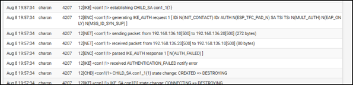
</p>

The relevant log evidence included:

`AUTHENTICATION_FAILED`

This was important because the peers were already exchanging packets. The evidence therefore pointed to an authentication problem rather than a basic WAN connectivity failure.

#### Root Cause

The pre-shared key configured on the Lisbon firewall did not match the key configured on the Porto firewall.

Because the PSK is used during IKE authentication, the mismatch prevented Phase 1 from completing successfully.

#### Correction

The pre-shared key was made identical on both IPsec peers.

The key itself is intentionally excluded from this repository.

#### VPN State After Correction

After correcting the authentication configuration, the Lisbon-Porto tunnel successfully negotiated again.

<p align="center">
  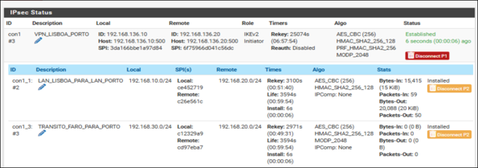
</p>

The recovered state showed:

- Phase 1: **Established**
- Phase 2: **Installed**

This confirmed that IKE authentication and the required traffic Security Association had been restored.

#### Functional Validation

Tunnel state alone was not considered sufficient evidence of recovery. Connectivity between the protected networks was tested again after the correction.

<p align="center">
  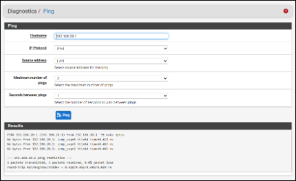
</p>

The final test completed with **0% packet loss**, confirming that traffic between the sites was flowing again.

#### Diagnostic Conclusion

| Stage | Evidence |
|---|---|
| Initial state | Known-good VPN baseline |
| Symptom | Phase 1 could not establish |
| Evidence | `AUTHENTICATION_FAILED` in IPsec logs |
| Root cause | Mismatched pre-shared key |
| Correction | Matching PSK restored on both peers |
| Technical validation | Phase 1 `Established`, Phase 2 `Installed` |
| Functional validation | Inter-site connectivity restored with 0% packet loss |

**Key lesson:** successful communication between the VPN peers does not prove successful IPsec authentication. IKE logs were required to distinguish a PSK mismatch from a transport or routing problem.

### Incident 2 — Phase 1 Established but Phase 2 Misconfigured

A second controlled failure was introduced by changing the remote network selector for the Lisbon-Porto Phase 2 association from the correct Porto network `192.168.20.0/24` to `192.168.30.0/24`.

This scenario was designed to demonstrate that an established IKE session does not guarantee functional connectivity between the protected LANs.

#### Symptom

The Lisbon-Porto Phase 1 remained **Established**, but the Phase 2 association responsible for transporting Porto traffic was no longer operational.

<p align="center">
  
</p>

The incorrect selector referenced `192.168.30.0/24` instead of the Porto LAN `192.168.20.0/24`.

#### Functional Impact

Although IKE negotiation remained active, traffic between Porto and Lisbon could not use the expected IPsec Security Association.

<p align="center">
  
</p>

The connectivity test resulted in **100% packet loss**.

This distinction is important: the VPN could appear partially healthy because Phase 1 was still established, while the actual protected traffic was unable to reach the remote LAN.

#### Root Cause

The Phase 2 remote network selector was configured as:

`192.168.30.0/24`

instead of the correct Porto network:

`192.168.20.0/24`

The Phase 1 Security Association therefore remained valid, but the Phase 2 traffic selector did not match the network that needed to be protected.

#### Correction

The remote network selector was restored to `192.168.20.0/24`.

After renegotiation, the required Phase 2 Security Association returned to **Installed** state.

<p align="center">
  
</p>

#### Functional Validation

Connectivity between the sites was tested again after the selector was corrected.

<p align="center">
  
</p>

The final test completed with **0% packet loss**, confirming that protected traffic was again being transported correctly between the two LANs.

#### Diagnostic Conclusion

| Stage | Evidence |
|---|---|
| Initial condition | Phase 1 remained `Established` |
| Symptom | Porto-Lisbon traffic failed |
| Evidence | Phase 2 referenced the wrong remote LAN |
| Root cause | Incorrect traffic selector |
| Correction | Remote network restored to `192.168.20.0/24` |
| Technical validation | Phase 2 returned to `Installed` |
| Functional validation | Connectivity restored with 0% packet loss |

**Key lesson:** an IPsec VPN showing Phase 1 as `Established` does not prove that application or even IP traffic can cross the tunnel. Phase 2 selectors and data-plane validation must be checked independently.

### Incident 3 — Incomplete Firewall Policy

A third controlled failure was introduced by reducing the permissions allowed between the Porto and Lisbon networks.

The IPsec VPN remained established, but the firewall policy did not permit all required traffic. ICMP, DNS and SMB became unavailable even though the tunnel itself was operational.

This scenario demonstrates that VPN establishment and firewall authorization are independent layers of connectivity.

#### Symptom 1 — ICMP Failure

The Porto client could no longer receive ICMP replies from the Lisbon network.

<p align="center">
  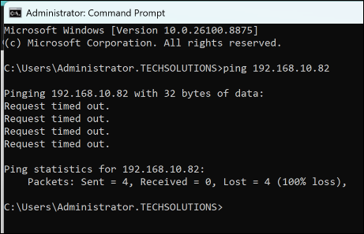
</p>

The test resulted in **100% packet loss**.

The VPN being established therefore did not prove that traffic was authorized through the firewall.

#### Symptom 2 — DNS Timeout

Internal DNS queries from Porto also failed.

<p align="center">
  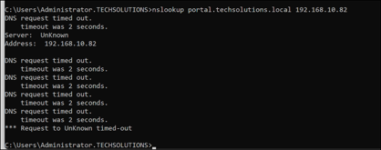
</p>

Without the required DNS permission, the Porto client could not resolve internal corporate names.

#### Symptom 3 — SMB Unavailable

The file service was independently tested using TCP port 445.

<p align="center">
  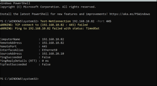
</p>

`Test-NetConnection` confirmed that TCP port `445` was not reachable from Porto.

The combined evidence showed that the problem was broader than ICMP and affected multiple services crossing the VPN.

#### Root Cause

The IPsec firewall policy contained insufficient permissions for the traffic required between Porto and Lisbon.

The VPN Security Associations could therefore remain active while the firewall independently blocked legitimate inter-site traffic.

#### Correction

The firewall policy was rebuilt using explicit rules identified by protocol and service.

Specific permissions were created for ICMP, DNS and SMB. Additional HTTP and MariaDB permissions were later added to support complete application-layer validation.

A broad generic `Any` rule was not used as the final policy.

<p align="center">
  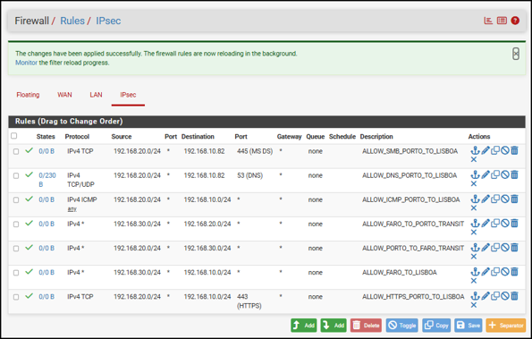
</p>

This approach made the permitted traffic easier to audit and aligned the configuration with a least-privilege model.

#### ICMP Validation

ICMP connectivity was tested again after applying the corrected rules.

<p align="center">
  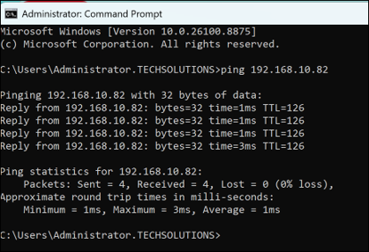
</p>

The ping completed with **0% packet loss**.

#### DNS Validation

Internal DNS resolution was then tested independently.

<p align="center">
  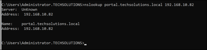
</p>

The internal hostname:

`portal.techsolutions.local`

successfully resolved to:

`192.168.10.82`

This confirmed that DNS traffic between Porto and the centralized Lisbon DNS service was again permitted.

#### SMB Validation

Finally, TCP port 445 was retested from Porto.

<p align="center">
  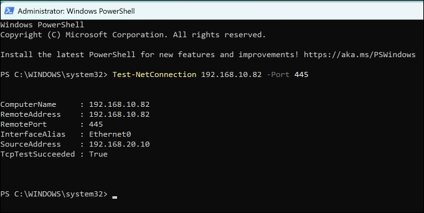
</p>

The SMB service became reachable again, confirming that the required file-service traffic was allowed through the IPsec firewall policy.

#### Diagnostic Conclusion

| Stage | Evidence |
|---|---|
| Initial condition | IPsec VPN remained established |
| ICMP symptom | 100% packet loss |
| DNS symptom | Internal DNS queries timed out |
| SMB symptom | TCP 445 was unreachable |
| Root cause | Incomplete firewall policy |
| Correction | Explicit service-specific firewall rules |
| ICMP validation | Ping restored with 0% packet loss |
| DNS validation | `portal.techsolutions.local` resolved to `192.168.10.82` |
| SMB validation | TCP 445 became reachable again |

**Key lesson:** an established IPsec tunnel proves that the VPN control plane is operational, but it does not prove that required business traffic is authorized. Firewall policy and individual application services must be validated independently.

### Incident 4 — Incorrect DNS Configuration

A fourth controlled failure was introduced by changing the DNS server configured on `CLIENTE-PORTO` from the corporate DNS service to the public resolver `8.8.8.8`.

The client retained network connectivity, but internal corporate names could no longer be resolved because the public DNS service had no knowledge of the private `techsolutions.local` zone.

#### Misconfigured Client

The Porto client was deliberately configured to use:

`8.8.8.8`

as its DNS server.

<p align="center">
  
</p>

This created a realistic failure condition in which IP connectivity could still exist while access to internally published services by hostname failed.

#### Resolution Failure

The internal hostname was then queried using the public DNS configuration.

<p align="center">
  
</p>

The query for:

`portal.techsolutions.local`

returned **Non-existent domain** through `dns.google`.

The result showed that the DNS server itself was responding, but it did not contain the private corporate zone required to resolve the internal hostname.

#### Root Cause

The client was using a public DNS resolver instead of the centralized corporate DNS server.

Public DNS services can resolve Internet namespaces, but the private `techsolutions.local` zone exists only within the laboratory infrastructure.

The correct corporate DNS server was:

`192.168.10.82`

#### Correction

The DNS configuration on `CLIENTE-PORTO` was restored to:

`192.168.10.82`

<p align="center">
  
</p>

The local DNS cache was then cleared before repeating the resolution test.

#### Functional Validation

The internal hostname was queried again after restoring the corporate DNS configuration.

<p align="center">
  
</p>

The hostname:

`portal.techsolutions.local`

successfully resolved to:

`192.168.10.82`

This confirmed that the client was again using the DNS infrastructure capable of resolving the private corporate zone.

#### Diagnostic Conclusion

| Stage | Evidence |
|---|---|
| Initial condition | Client DNS changed to `8.8.8.8` |
| Symptom | Internal hostname could not be resolved |
| Evidence | `dns.google` returned Non-existent domain |
| Root cause | Public DNS did not contain the private `techsolutions.local` zone |
| Correction | Corporate DNS `192.168.10.82` restored |
| Additional action | Local DNS cache cleared |
| Functional validation | `portal.techsolutions.local` resolved to `192.168.10.82` |

**Key lesson:** successful IP connectivity does not prove correct DNS configuration. When internal services fail by hostname, the configured resolver and the DNS zone responsible for that namespace must be validated independently.

### Incident 5 — Incorrect Default Gateway

A fifth controlled failure was introduced by changing the default gateway configured on `CLIENTE-PORTO`.

The correct gateway for the Porto network was `192.168.20.1`, but the client was deliberately configured to use `192.168.20.254`.

The VPN and firewall remained operational, but the endpoint could no longer correctly forward traffic destined for remote networks.

#### Misconfigured Default Gateway

The client routing configuration showed the incorrect default gateway:

`192.168.20.254`

<p align="center">
  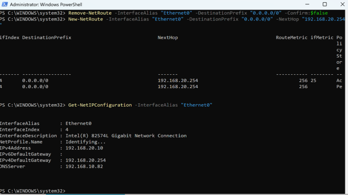
</p>

This isolated the fault to the endpoint routing configuration rather than the IPsec infrastructure.

#### Connectivity Failure

Communication with the Lisbon server was then tested.

<p align="center">
  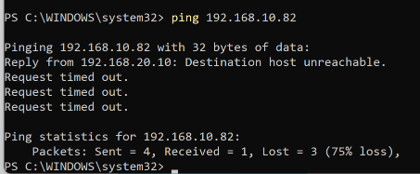
</p>

The client generated:

`Destination host unreachable`

This message was generated locally by `CLIENTE-PORTO`.

It therefore did not represent a reply from the remote Lisbon server. It indicated that the local host could not correctly forward the packet toward the destination network.

#### Root Cause

The default gateway configured on `CLIENTE-PORTO` was incorrect.

The client belonged to the `192.168.20.0/24` network and should have used the Porto pfSense firewall as its gateway:

`192.168.20.1`

Instead, the configured route pointed to:

`192.168.20.254`

As a result, traffic destined for networks outside the local subnet could not be routed correctly.

#### Correction

The default gateway was restored to:

`192.168.20.1`

<p align="center">
  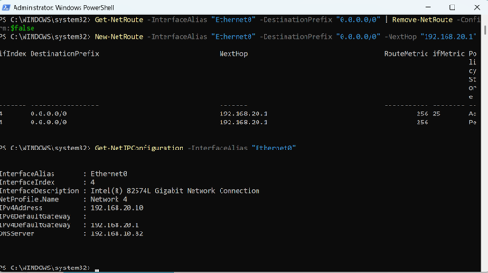
</p>

The client was again configured to use the Porto firewall as its route toward remote networks.

#### Functional Validation

Connectivity with the Lisbon server was tested again after restoring the correct gateway.

<p align="center">
  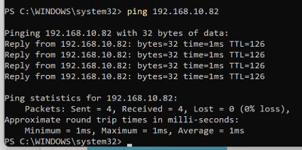
</p>

The final ping to `SRV-LISBOA` completed with **0% packet loss**.

This confirmed that routing from the Porto client toward the remote Lisbon network had been restored.

#### Diagnostic Conclusion

| Stage | Evidence |
|---|---|
| Initial condition | VPN and firewall remained operational |
| Misconfiguration | Default gateway changed to `192.168.20.254` |
| Symptom | Remote network became unreachable |
| Evidence | Local `Destination host unreachable` message |
| Root cause | Incorrect endpoint default route |
| Correction | Gateway restored to `192.168.20.1` |
| Functional validation | Ping to `SRV-LISBOA` restored with 0% packet loss |

**Key lesson:** when VPN and firewall infrastructure are operational but one endpoint cannot reach remote networks, local routing must be validated before changing the tunnel configuration. A locally generated unreachable message is evidence that the failure may occur before traffic ever reaches the VPN gateway.

### Additional Incident — Active Directory Secure Channel Failure

During final validation, an additional problem was discovered that had not been part of the five planned troubleshooting scenarios.

`CLIENTE-PORTO` still appeared to belong to the `techsolutions.local` domain, but its secure channel with Active Directory was no longer operational.

Unlike the previous incidents, this failure was not intentionally introduced. It therefore became a real troubleshooting case within the laboratory.

#### Initial Symptom

The domain trust relationship was tested with:

`Test-ComputerSecureChannel -Verbose`

<p align="center">
  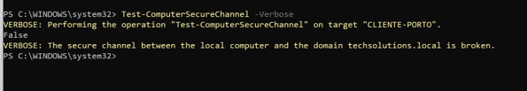
</p>

The command returned:

`False`

This confirmed that the secure channel between `CLIENTE-PORTO` and the domain was not operational.

#### Network Layer Investigation

Basic connectivity to `SRV-LISBOA` was still available through ICMP.

The investigation therefore moved beyond simple IP reachability and tested individual Active Directory dependencies.

Several required TCP services were initially unavailable:

- LDAP — TCP `389`
- Kerberos — TCP `88`
- RPC Endpoint Mapper — TCP `135`

A temporary diagnostic firewall rule, restricted to traffic from `CLIENTE-PORTO` to `SRV-LISBOA`, was used to determine whether the firewall policy was responsible.

After applying the temporary diagnostic permission, the same service tests began succeeding.

#### LDAP Validation

<p align="center">
  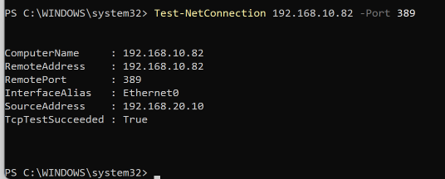
</p>

TCP port `389` became reachable, confirming that LDAP communication with the domain controller was no longer being blocked.

#### Kerberos Validation

<p align="center">
  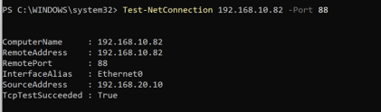
</p>

TCP port `88` also became reachable, confirming restoration of the tested Kerberos flow.

#### RPC Validation

<p align="center">
  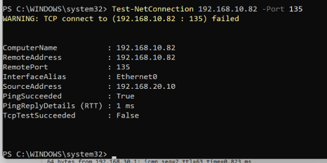
</p>

TCP port `135` became reachable as well.

The combination of these results provided strong evidence that the firewall policy, rather than the VPN tunnel itself, was preventing the Active Directory communication required by the client.

#### Root Cause

The IPsec VPN was functional, but the firewall policy did not yet permit all traffic required for Active Directory communication between the Porto network and `SRV-LISBOA`.

The client could therefore reach the remote network while still being unable to maintain a valid domain secure channel.

#### Permanent Correction

After confirming the cause with the temporary diagnostic rule, dedicated Active Directory aliases and permanent TCP/UDP firewall rules were created.

The destination was restricted to `SRV-LISBOA`, avoiding a broad permanent `Any` policy.

The secure channel was then repaired using:

`Test-ComputerSecureChannel -Repair`

<p align="center">
  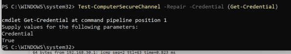
</p>

The repair returned:

`True`

This indicated that the trust relationship had been successfully re-established.

#### Final Least-Privilege Firewall Policy

The temporary broad diagnostic permission was removed after the cause had been confirmed.

The final firewall configuration used dedicated Active Directory rules and aliases instead.

<p align="center">
  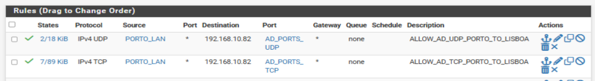
</p>

This preserved the required domain functionality while keeping the allowed traffic explicitly scoped.

#### Final Secure Channel Validation

The secure channel was tested again after removing the temporary diagnostic permission.

<p align="center">
  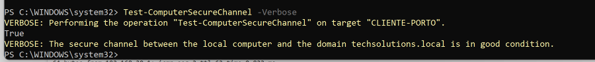
</p>

`Test-ComputerSecureChannel` returned:

`True`

and reported that the secure channel was in **good condition**.

This final test demonstrated that the permanent firewall policy was sufficient and that the recovery did not depend on the temporary diagnostic rule.

#### Diagnostic Conclusion

| Stage | Evidence |
|---|---|
| Initial symptom | `Test-ComputerSecureChannel` returned `False` |
| Basic connectivity | ICMP to `SRV-LISBOA` remained functional |
| Service evidence | LDAP 389, Kerberos 88 and RPC 135 were blocked |
| Diagnostic test | Temporary restricted firewall permission made the port tests succeed |
| Root cause | Required Active Directory traffic was blocked by the firewall policy |
| Permanent correction | Dedicated AD TCP/UDP aliases and rules created |
| Repair | `Test-ComputerSecureChannel -Repair` returned `True` |
| Security cleanup | Temporary broad diagnostic rule removed |
| Final validation | Secure channel remained `True` and in good condition |

**Key lesson:** successful VPN connectivity and even successful ICMP reachability do not prove that Active Directory is operational across a site-to-site tunnel. Domain functionality depends on multiple service-specific flows, and firewall policy must support those dependencies without relying on unnecessarily broad permanent rules.

## Project Status

**Completed laboratory implementation and validation.**

The final environment successfully demonstrated multi-site connectivity and remote access to centralized **Active Directory, DNS, IIS, MariaDB and SMB services**.

---

**Note:** This project was developed in an authorized laboratory environment for training and portfolio purposes. Credentials and other sensitive configuration values are intentionally excluded from the public documentation.
