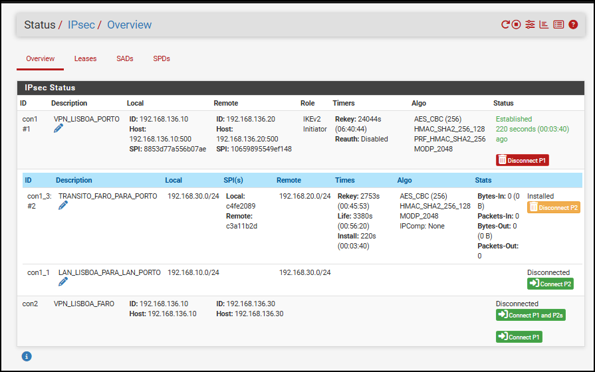
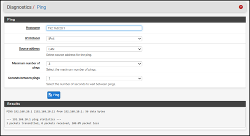
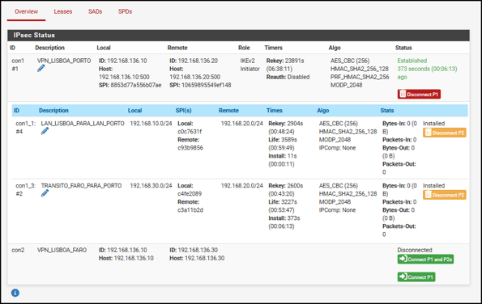
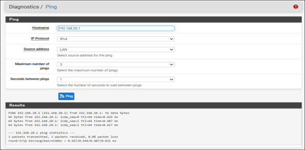

# Incident 02 — IPsec Phase 2 Selector Mismatch

## Summary

A controlled failure was introduced in the Lisbon-Porto site-to-site IPsec VPN by changing the remote network selector of the Lisbon-Porto Phase 2 association.

Phase 1 remained established, but protected traffic between the Lisbon and Porto LANs stopped working.

The objective was to demonstrate that a healthy IKE session does not prove that the correct traffic selectors or data-plane Security Associations are in place.

## Environment

| Component | Configuration |
|---|---|
| VPN peers | pfSense Lisbon and pfSense Porto |
| VPN type | Site-to-Site IPsec |
| IKE version | IKEv2 |
| Lisbon LAN | `192.168.10.0/24` |
| Porto LAN | `192.168.20.0/24` |
| Incorrect remote selector | `192.168.30.0/24` |
| Correct remote selector | `192.168.20.0/24` |

## Known-Good Baseline

Before introducing the fault, the Lisbon-Porto VPN was fully operational.

Phase 1 was established, Phase 2 was installed and traffic between the protected networks was flowing correctly.

A single Phase 2 parameter was then changed to create a controlled failure.

## Fault Introduced

The remote network selector for the Lisbon-Porto Phase 2 association was changed from:

`192.168.20.0/24`

to:

`192.168.30.0/24`

The altered selector no longer matched the actual Porto LAN.

## Symptom

The Lisbon-Porto Phase 1 remained established, but the Phase 2 association responsible for transporting Porto traffic was no longer operational.

  

The evidence showed that the IKE control plane was still active while the traffic selector for the protected LAN was incorrect.

## Functional Impact

Connectivity between the protected networks failed.

  

The test completed with:

**100% packet loss**

This demonstrated that Phase 1 being established was not sufficient for end-to-end connectivity.

## Diagnostic Reasoning

The evidence was evaluated by separating control-plane state from data-plane behavior.

| Observation | Interpretation |
|---|---|
| Phase 1 remained `Established` | IKE negotiation between the peers was still successful |
| Phase 2 was not operational | Protected traffic parameters required investigation |
| Remote selector referenced `192.168.30.0/24` | Selector did not match the Porto LAN |
| Ping failed with 100% packet loss | No functional path existed for the intended protected traffic |
| Correct selector was `192.168.20.0/24` | Root cause identified |

### What This Test Proved

The VPN peers could still establish the IKE session, but the configured Phase 2 traffic selector did not match the network that needed to be protected.

### What This Test Did Not Prove

An established Phase 1 did not prove that application traffic, IP connectivity or the correct Phase 2 Security Association was available.

These layers had to be validated separately.

## Root Cause

The Phase 2 remote network selector was configured as:

`192.168.30.0/24`

instead of the actual Porto network:

`192.168.20.0/24`

As a result, the Phase 2 definition did not describe the intended protected traffic.

## Correction

The remote network selector was restored to:

`192.168.20.0/24`

No unrelated VPN setting was modified.

## Technical Validation

After correcting the selector, the Phase 2 association was successfully restored.

  

The corrected state showed the expected Phase 2 Security Association as:

**Installed**

This confirmed that the intended Lisbon-Porto protected networks were again represented by an active IPsec Security Association.

## Functional Validation

Connectivity between the Lisbon and Porto networks was tested again after the correction.

  

The final test completed with:

**0% packet loss**

This confirmed that traffic between the protected networks was again flowing correctly.

## Incident Timeline

| Stage | Result |
|---|---|
| Baseline | Phase 1 established, Phase 2 installed, traffic operational |
| Fault introduced | Remote selector changed to `192.168.30.0/24` |
| Control-plane state | Phase 1 remained `Established` |
| Data-plane symptom | Inter-site connectivity failed |
| Functional evidence | 100% packet loss |
| Root cause | Incorrect Phase 2 remote network selector |
| Correction | Remote selector restored to `192.168.20.0/24` |
| Technical validation | Phase 2 returned to `Installed` |
| Functional validation | Connectivity restored with 0% packet loss |

## Key Technical Takeaway

An IPsec VPN showing Phase 1 as `Established` does not prove that protected traffic can cross the tunnel.

Troubleshooting must distinguish between:

- IKE peer negotiation;
- Phase 2 traffic selectors;
- IPsec Security Association state;
- actual end-to-end connectivity.

A VPN should only be considered operational after both control-plane and data-plane validation succeed.
