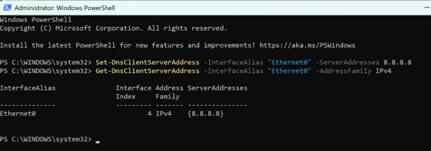
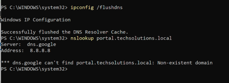
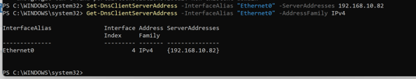
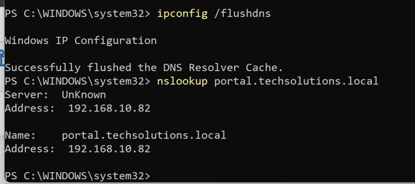

# Incident 04 — Incorrect DNS Configuration

## Summary

A controlled failure was introduced by changing the DNS server configured on `CLIENTE-PORTO` from the internal corporate DNS service to the public resolver `8.8.8.8`.

The client retained IP connectivity, but internal corporate names could no longer be resolved because the public DNS service did not contain the private `techsolutions.local` zone.

The objective was to distinguish a DNS configuration problem from a general network or VPN failure.

## Environment

| Component | Configuration |
|---|---|
| Client | `CLIENTE-PORTO` |
| Corporate domain | `techsolutions.local` |
| Internal DNS server | `192.168.10.82` |
| Deliberately incorrect DNS | `8.8.8.8` |
| Internal test hostname | `portal.techsolutions.local` |

## Known-Good Baseline

Before introducing the fault, `CLIENTE-PORTO` used the centralized DNS service hosted in Lisbon and could resolve internal corporate names correctly.

The DNS configuration was then deliberately changed while leaving the VPN and IP connectivity otherwise operational.

## Fault Introduced

The DNS server configured on `CLIENTE-PORTO` was changed from the corporate DNS service:

`192.168.10.82`

to the public resolver:

`8.8.8.8`

  

The public resolver could answer Internet DNS queries but had no knowledge of the private `techsolutions.local` namespace.

## Symptom

The Porto client could no longer resolve the internal hostname:

`portal.techsolutions.local`

The failure occurred even though the client still had network connectivity.

## Evidence

The internal hostname was queried while the client was using `8.8.8.8`.

  

The query returned:

`Non-existent domain`

through `dns.google`.

This result was diagnostically significant because the DNS server itself was reachable and responding.

The failure was therefore not caused by a total loss of connectivity to the resolver.

## Diagnostic Reasoning

The evidence was evaluated by separating network reachability from name resolution.

| Observation | Interpretation |
|---|---|
| Client retained IP connectivity | General network failure was less likely |
| DNS server `8.8.8.8` responded | Resolver itself was reachable |
| Internal hostname returned NXDOMAIN | Resolver did not know the private zone |
| Corporate namespace was `techsolutions.local` | Internal DNS service was required |
| Correct internal DNS was `192.168.10.82` | Root cause identified |

### What This Test Proved

The test proved that the configured resolver was reachable but did not contain the private corporate namespace required to resolve internal services.

### What This Test Did Not Prove

The NXDOMAIN response did not prove a VPN or routing failure.

It showed that the wrong DNS authority was being queried for an internal name.

## Root Cause

`CLIENTE-PORTO` was configured to use the public DNS resolver `8.8.8.8` instead of the corporate DNS server.

The private `techsolutions.local` zone existed only within the internal infrastructure.

As a result, the public resolver correctly returned NXDOMAIN for the internal hostname.

## Correction

The DNS configuration on `CLIENTE-PORTO` was restored to:

`192.168.10.82`

  

The local DNS cache was then cleared before repeating the resolution test.

## Functional Validation

The internal hostname was queried again after restoring the corporate DNS configuration.

  

The hostname:

`portal.techsolutions.local`

successfully resolved to:

`192.168.10.82`

This confirmed that the client was once again using the DNS service authoritative for the private corporate zone.

## Incident Timeline

| Stage | Result |
|---|---|
| Baseline | Internal DNS resolution operational |
| Fault introduced | DNS changed to `8.8.8.8` |
| Symptom | Internal hostname failed to resolve |
| Evidence | `dns.google` returned Non-existent domain |
| Root cause | Public DNS did not contain the private `techsolutions.local` zone |
| Correction | DNS restored to `192.168.10.82` |
| Additional action | Local DNS cache cleared |
| Functional validation | `portal.techsolutions.local` resolved to `192.168.10.82` |

## Key Technical Takeaway

Successful IP connectivity does not prove correct DNS configuration.

When an internal service fails by hostname, troubleshooting should validate:

- which DNS server the client is using;
- whether that resolver is authoritative or has access to the required zone;
- whether the failure is NXDOMAIN, timeout or another DNS response;
- whether the name resolves correctly after restoring the intended resolver.

The incident was considered resolved only after the client was returned to the corporate DNS service and internal name resolution was successfully validated.
